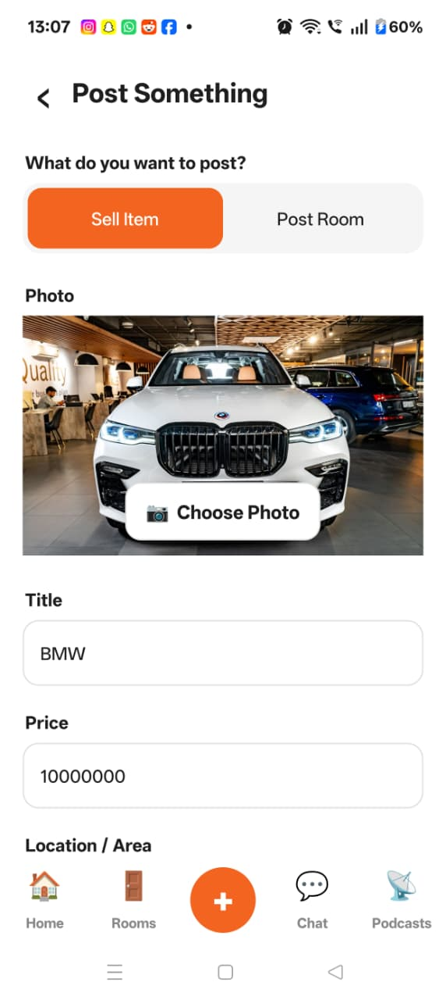
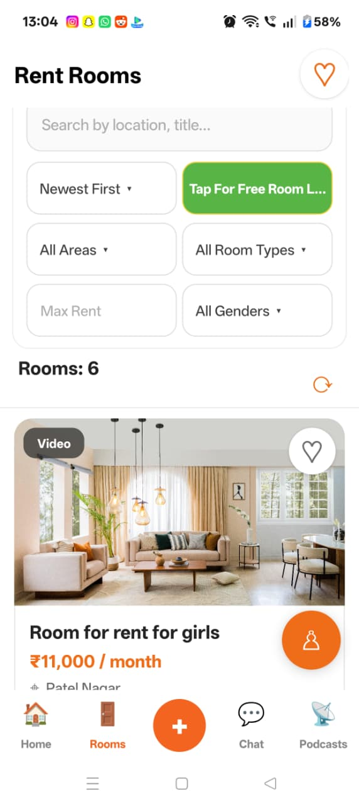
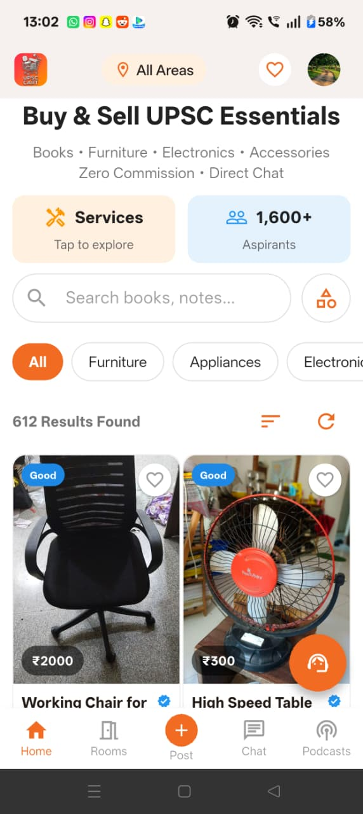
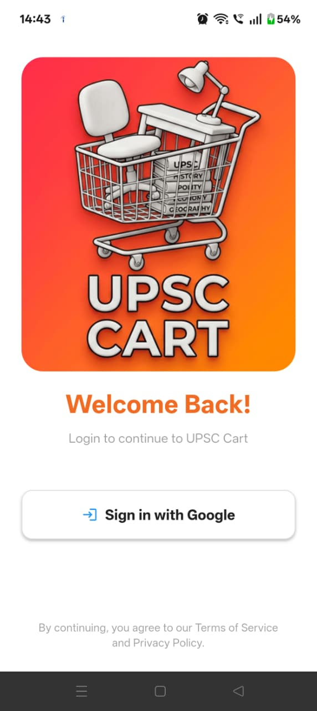

<div align="center">

# 🛒 UPSC Cart

**An Android marketplace app for buying, selling & renting — built for the UPSC aspirant community.**

[](https://github.com/AmanKumar925/upsc-cart-android)
[](https://github.com/AmanKumar925/upsc-cart-android)
[](https://firebase.google.com/)
[](https://gradle.org/)
[](LICENSE)

[Report Bug](https://github.com/AmanKumar925/upsc-cart-android/issues) · [Request Feature](https://github.com/AmanKumar925/upsc-cart-android/issues)

</div>

---

## 📖 About the Project

**UPSC Cart** is a native Android marketplace built specifically for UPSC aspirants to **buy, sell, and rent** essentials — books, furniture, electronics, and study accessories — directly with other aspirants, with **zero commission** and **direct chat**. It also includes a dedicated **room rental** module for aspirants looking for accommodation near coaching hubs.

The app is built with a focus on a fast, intuitive posting flow, real-time listings, and safe in-app communication between buyers and sellers.

> Built end-to-end (UI, Firebase integration, real-time listings, chat, and onboarding) as a solo Android project.

---

## ✨ Features

- 🛍️ **Buy & Sell Marketplace** — Post and browse listings for books, furniture, electronics, and accessories with category filters and search.
- 🏠 **Rent Rooms** — Browse and post room listings with filters for area, room type, gender preference, and max rent.
- ➕ **Quick Post Flow** — Post an item or a room in seconds with photo upload, title, price, and location.
- 💬 **In-App Chat** — Message buyers/sellers directly and safely within the app, with message management (long-press to delete).
- ❤️ **Favorites** — Save listings with a single tap and revisit them anytime.
- 🔍 **Search & Filter** — Quickly narrow down listings by location, category, price range, and more.
- 🔐 **Google Sign-In** — Fast, secure authentication powered by Firebase Auth.
- 🎧 **Podcasts Section** — Additional content hub for the aspirant community.
- 👋 **Guided Onboarding** — A polished first-launch walkthrough introducing core features.

---

## 📱 Screenshots

<div align="center">

| Post an Item | Rent Rooms | Marketplace | Sign In |
|:---:|:---:|:---:|:---:|
|  |  |  |  |

</div>

> Replace the paths above with the actual images inside the [`/screenshots`](./screenshots) folder of this repo.

---

## 🛠️ Tech Stack

| Layer | Technology |
|---|---|
| Language | Java |
| Platform | Android (native) |
| Backend / Auth / DB | Firebase (Authentication, Firestore/Realtime Database, Storage) |
| Build System | Gradle |
| Sign-In | Google Sign-In via Firebase Auth |

---

## 🏗️ Architecture & Key Modules

```
upsc-cart-android/
├── app/
│   ├── src/main/java/...    # Activities, Adapters, Firebase logic
│   ├── src/main/res/        # Layouts, drawables, themes
│   └── AndroidManifest.xml
├── gradle/
├── screenshots/             # App screenshots for documentation
├── build.gradle
└── settings.gradle
```

**Core modules:**
- `Post` — Sell Item / Post Room creation flow with image picker
- `Marketplace (Home)` — Category-based buy & sell listings feed
- `Rooms` — Room rental listings with multi-filter search
- `Chat` — Real-time buyer–seller messaging
- `Auth` — Firebase Google Sign-In
- `Favorites` — Saved/bookmarked listings

---

## 🚀 Getting Started

### Prerequisites
- Android Studio (latest stable)
- JDK 11+
- A Firebase project (with Authentication, Firestore/Realtime DB, and Storage enabled)

### Installation

1. **Clone the repository**
   ```bash
   git clone https://github.com/AmanKumar925/upsc-cart-android.git
   cd upsc-cart-android
   ```

2. **Connect Firebase**
   - Create a project in the [Firebase Console](https://console.firebase.google.com/).
   - Enable **Authentication** (Google Sign-In), **Firestore/Realtime Database**, and **Storage**.
   - Download the `google-services.json` file and place it inside the `app/` directory.

3. **Open in Android Studio**
   - Open the project folder.
   - Let Gradle sync automatically.

4. **Run the app**
   - Connect a device/emulator and hit **Run ▶**.

---

## 🗺️ Roadmap

- [ ] Push notifications for new messages
- [ ] In-app price negotiation
- [ ] Verified seller badges
- [ ] Location-based listing recommendations
- [ ] Dark mode

---

## 🤝 Contributing

Contributions are welcome! Feel free to open an issue or submit a pull request.

1. Fork the project
2. Create your feature branch (`git checkout -b feature/AmazingFeature`)
3. Commit your changes (`git commit -m 'Add some AmazingFeature'`)
4. Push to the branch (`git push origin feature/AmazingFeature`)
5. Open a Pull Request

---

## 📄 License

Distributed under the MIT License. See `LICENSE` for more information.

---

## 👤 Author

**Aman Kumar**

[](https://github.com/AmanKumar925)

<div align="center">
⭐ If you found this project interesting, consider giving it a star!
</div>
